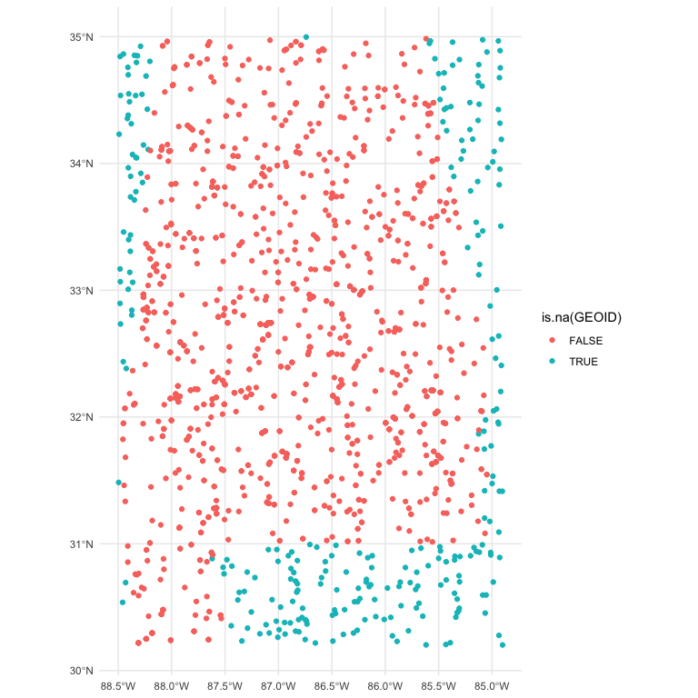
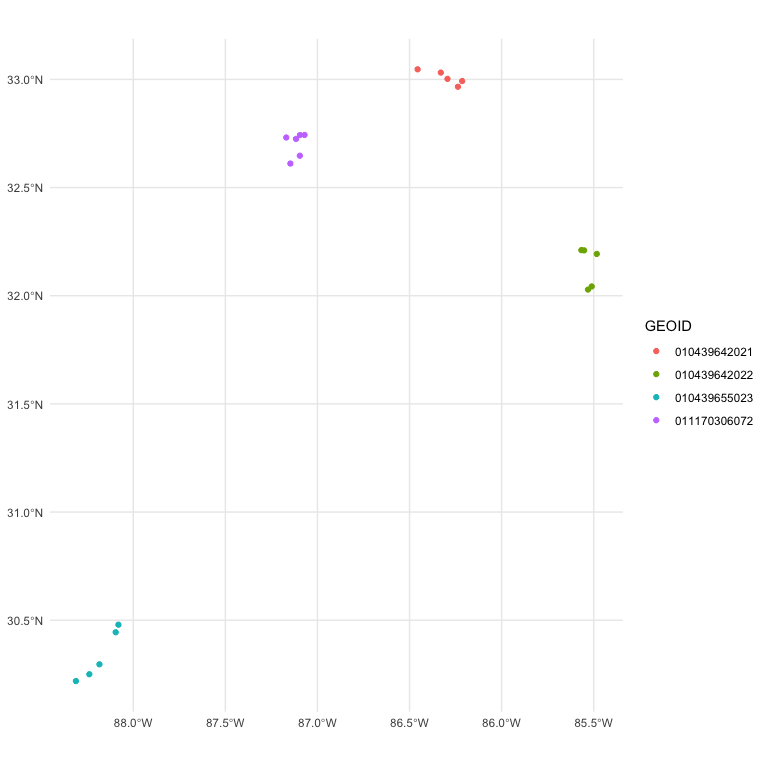

<!-- README.md is generated from README.Rmd. Please edit that file -->

# bullseye 🎯

<!-- badges: start -->
<!-- badges: end -->

The goal of bullseye is to make it easy to build and serve
point-in-polygon queries quickly. Under the hood, it uses the great new
packages [geoarrow](https://paleolimbot.github.io/geoarrow/) and
[rsgeo](https://rsgeo.josiahparry.com/).

## Installation

You can install the development version of bullseye like so:

``` r
remotes::install_github("pitt-ptrc/bullseye)
```

## Example

Given an address, the US Census free API service will assign coordinates
and FIPS code to it.
[tidygeocoder](https://jessecambon.github.io/tidygeocoder/) will help.

In medical research, however, sharing personal identifying information
(PII) with third-parties is not allowed.
[Nominatim](https://github.com/mediagis/nominatim-docker), powered by
OpenStreetMap will assign coordinates for you. For the FIPS codes,
`bullseye` will help.

Currently `bullseye` can only build from census resources. The plan is
to expand this arbitrary directories containing geometries.

Here we retrieve Alabama census block groups.

``` r
library(bullseye)
library(geoarrow)
library(dplyr)
#> 
#> Attaching package: 'dplyr'
#> The following objects are masked from 'package:stats':
#> 
#>     filter, lag
#> The following objects are masked from 'package:base':
#> 
#>     intersect, setdiff, setequal, union


# create db
poly_db_name <- "test_cen.parquet"
main_pipeline(base_url = "https://www2.census.gov/geo/tiger/TIGER2021/BG/",
              filename = poly_db_name,  
              n_limit = 2,
              save = FALSE) # default is TRUE, but vignettes disallow saving.
#> Reading layer `tl_2021_01_bg' from data source 
#>   `/private/var/folders/bp/l5qt50g13sndlz0x48jqqv300000gn/T/Rtmp1KFQRr/tl_2021_01_bg/tl_2021_01_bg.shp' 
#>   using driver `ESRI Shapefile'
#> Simple feature collection with 3925 features and 12 fields
#> Geometry type: MULTIPOLYGON
#> Dimension:     XY
#> Bounding box:  xmin: -88.47323 ymin: 30.14442 xmax: -84.88825 ymax: 35.00803
#> Geodetic CRS:  NAD83
#> Reading layer `tl_2021_02_bg' from data source 
#>   `/private/var/folders/bp/l5qt50g13sndlz0x48jqqv300000gn/T/Rtmp1KFQRr/tl_2021_02_bg/tl_2021_02_bg.shp' 
#>   using driver `ESRI Shapefile'
#> Simple feature collection with 504 features and 12 fields
#> Geometry type: MULTIPOLYGON
#> Dimension:     XY
#> Bounding box:  xmin: -179.2311 ymin: 51.17509 xmax: 179.8597 ymax: 71.43979
#> Geodetic CRS:  NAD83
```

Once built, we can query.

``` r
# simulate points
data("al_coord")
al_coord |> head()
#> Simple feature collection with 6 features and 1 field
#> Geometry type: POINT
#> Dimension:     XY
#> Bounding box:  xmin: -87.92333 ymin: 30.41867 xmax: -85.42765 ymax: 34.71424
#> Geodetic CRS:  WGS 84
#>                     geometry STATEFP
#> 1 POINT (-87.51496 31.58037)      01
#> 2 POINT (-86.36208 33.98386)      01
#> 3 POINT (-87.92333 32.16309)      01
#> 4 POINT (-85.42765 34.43848)      01
#> 5 POINT (-85.44814 34.71424)      01
#> 6 POINT (-86.77961 30.41867)      01

# load db
filepath <- system.file("extdata", poly_db_name, package = "bullseye")
test_db <- geoarrow::read_geoparquet_sf(filepath)

# query db
res <- combined_spatial_join(pts_sf = al_coord,
                      polys_sf = test_db,
                      prefilter_col = "STATEFP", 
                      return_col = "GEOID")

res
#> Simple feature collection with 1568 features and 2 fields
#> Geometry type: POINT
#> Dimension:     XY
#> Bounding box:  xmin: -88.49584 ymin: 30.20223 xmax: -84.90171 ymax: 34.99714
#> Geodetic CRS:  WGS 84
#> # A tibble: 1,568 × 3
#>    STATEFP GEOID                    geometry
#>    <chr>   <chr>                 <POINT [°]>
#>  1 01      010950307022 (-87.51496 31.58037)
#>  2 01      010030111043 (-87.51496 31.58037)
#>  3 01      010119522021 (-86.36208 33.98386)
#>  4 01      010119522012 (-87.92333 32.16309)
#>  5 01      010970025022 (-87.92333 32.16309)
#>  6 01      010830202013 (-87.92333 32.16309)
#>  7 01      010890029231 (-87.92333 32.16309)
#>  8 <NA>    <NA>         (-85.42765 34.43848)
#>  9 <NA>    <NA>         (-85.44814 34.71424)
#> 10 <NA>    <NA>         (-86.77961 30.41867)
#> # ℹ 1,558 more rows
```

If a point is not in the polygon database, an `NA` is returned.

``` r
library(ggplot2)

res |> 
  ggplot(aes(color = is.na(GEOID))) +
  geom_sf() +
  theme_minimal()
```



``` r

# whoops is the join working?

ids <- res |> 
  select(GEOID) |> 
  count(GEOID, sort = TRUE) |> 
  slice(7:10) |> 
  pull(GEOID)

res |> 
  filter(GEOID %in% ids) |> 
  ggplot(aes(color = GEOID)) +
  geom_sf() +
  theme_minimal()
```



## API

Do this as an API.

TODO: issue is that `call_that` generated API can’t find the `plumber.R`
But API works.

``` r
library(callthat)
library(httr2)

api_conn <- call_that_plumber_start(
  system.file("plumber/sample-api", package = "bullseye")
)

df <- data.frame(
  id = c(1, 2),
  lat = c(31.58037, 33.98386),
  lng = c(-87.51496, -86.36208)
)

# Create and tailor the request

# req <- request(api_conn) |>
#   req_method("POST") |>
#   req_body_json(data = df) |>
#   req_headers("Content-Type" = "application/json")

# this does the above, but with call_that
post_coord <- call_that_api_post(
      api_conn, 
      endpoint = "compute", 
      body = jsonlite::toJSON(df)
)


# Perform the request

# req |>
#   req_perform() |>
#   resp_body_json()

post_coord |> 
  resp_body_json()

call_that_plumber_stop(api_conn)
```

## Deploy

But that’s not all! `bullseye` comes with a Dockerfile. So just navigate
to the project folder, and build and run.

    docker build -t bullseye_image .
    docker run --rm -p 8000:8000 bullseye_image
